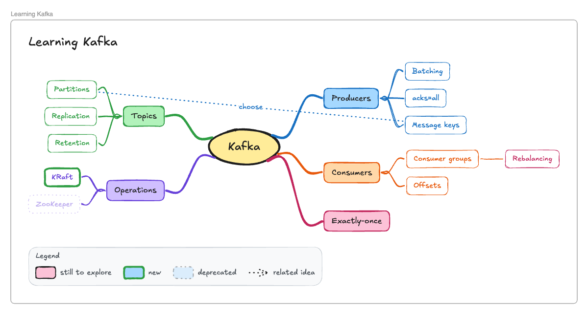
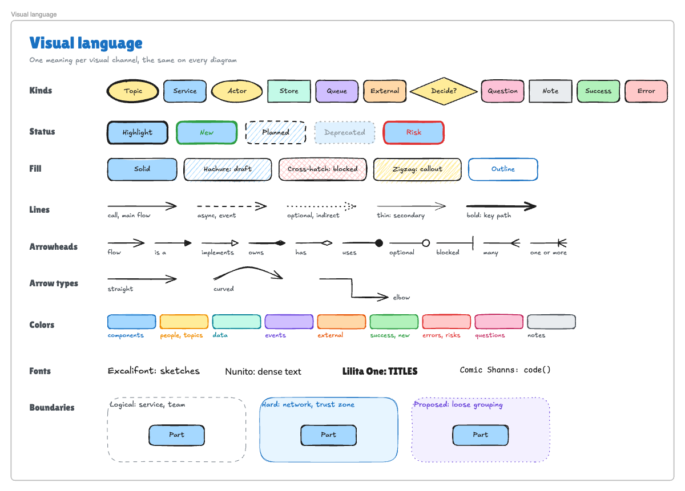
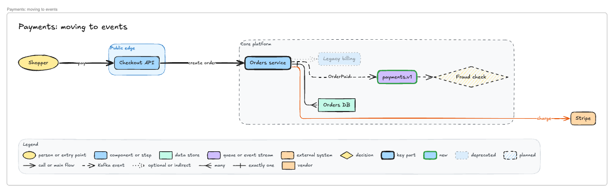

# Claude Whiteboard

A local Excalidraw board that Claude can draw on and read through a connector (MCP server), while you draw on the same board in your browser. It's built for visual learners: Claude sketches while it explains, points at what it's talking about, and uses a consistent visual language of colors, shapes, line styles, and legends.



```
 you ──draw──► Excalidraw tab (localhost:3170) ◄──WebSocket──► board server ◄── connector (/mcp/<secret>) ◄── Claude
```

- **Claude draws:** `draw_diagram` lays out flows, architectures, and mind maps; `draw` places individual elements; `draw_mermaid` converts Mermaid. Changes go through the board server to the open tab.
- **Claude reads:** `get_board` pulls the live board on demand, including what you changed since Claude last looked. `get_board_image` returns a picture, which helps with freehand sketches.
- **You draw:** use the board at http://localhost:3170 as normal. Everything is saved to `.data/board.excalidraw`.

## Setup (once)

```bash
npm install
npm run build
```

To reach the board from the Claude app (web, desktop, phone, voice mode) you also need a tunnel, because Claude connects to connectors from Anthropic's cloud rather than from your computer:

```bash
brew install cloudflared
```

## Each session

1. **Start the server**

   ```bash
   npm start
   ```

   It prints the board URL and your connector path, `/mcp/<secret>`. The secret is generated once and stored in `.data/connector-secret`.

2. **Open the board**: http://localhost:3170 in Chrome. The badge at the bottom right should say **Claude connector: live**.

3. **Start a tunnel** in a second terminal:

   ```bash
   npm run tunnel
   ```

   Copy the `https://….trycloudflare.com` address it prints.

4. **Add the connector in Claude** (first time, or whenever the tunnel address changes): Settings → Connectors → **Add custom connector**.
   - URL: `https://<tunnel-address>/mcp/<secret>`
   - Leave the OAuth fields empty.

   Then, in the connector's settings, set its tools to **Always allow**, so Claude doesn't stop to ask permission mid-conversation.

5. **Talk to Claude.** Make sure the connector is enabled for the chat, then start voice mode and try:
   - "Let's learn Kafka. Mind-map the main ideas, then walk me through producers step by step."
   - "Draw our checkout architecture. Mark the legacy billing service as deprecated and add a legend."
   - "Compare REST and gRPC side by side."
   - "I added a box for partitions. Can you see it?"
   - "Replay that diagram from the start."

To check the tunnel and connector from your computer:

```bash
npm run smoke -- https://<tunnel-address>/mcp/<secret>
```

This runs every drawing tool once (shapes, arrangement, the laser pointer, an animation, a flow diagram revealed in two steps, and a mind map), then removes what it drew. Set `SMOKE_KEEP=1` to leave it on the board.

### Check that voice mode can use it

Claude's voice mode officially lists built-in connectors (Gmail, Calendar, and so on), and there are reports of custom connector tools failing only in voice mode. Test it once:

1. In a **text** chat with the connector enabled, ask "What's on my whiteboard?". Claude should call `get_board`.
2. Ask the same in **voice mode**.

If voice mode can't call the tools, the same server still works from:
- **Claude app text chat:** type instead of talking.
- **Claude Code on this computer:** no tunnel needed. Add the connector with `claude mcp add --transport http excalidraw-board http://localhost:3170/mcp/<secret>`, then use `/voice` to dictate.

### A tunnel address that doesn't change

`cloudflared tunnel --url` gives a new address every run, so you'd update the connector URL each session. For a fixed address, use either of these:

- **Tailscale Funnel**: run `tailscale funnel --bg 3170`, then use `https://<machine>.<tailnet>.ts.net/mcp/<secret>`. Funnel must be enabled for your tailnet.
- **A named Cloudflare tunnel** on your own domain.

## Tools Claude gets

| Tool | What it does |
|---|---|
| `draw_diagram` | Nodes, edges, and groups in; a laid-out diagram out. **flow** layout (ELK) for systems, processes, and concept maps, with elbow, curved, or straight arrows routed around boxes; **mindmap** layout with a central topic and colored, curved branches. A hand-drawn or clean look, styles, statuses, and an automatic legend. Parts can appear step by step (`show_step`), and later calls with the same id add, change, or remove parts. |
| `draw` | Individual elements with every Excalidraw property: create (new id), update (existing id, only the fields given), delete, and move your view. Also groups, aligns, spaces out, and reorders layers (`group`, `align`, `distribute`, `order`). Arrows can connect to any shape, including ones you drew. |
| `draw_mermaid` | Mermaid → editable shapes with automatic layout (flowchart, sequence, class, ER, state). Other diagram types come in as a single image. |
| `point_at` | Claude's laser pointer: circles shapes, traces arrows in their direction, and underlines text as Claude talks about them, scrolling your view if needed. A script paces the pointer to what Claude is saying. |
| `animate` | Replays a hand-drawing animation of the board, a frame, or chosen elements in a full-screen player, in the order Claude picks (a diagram replays in its step order). Can save it as an animated SVG in `.data/animations/`. New drawings don't need it: they draw themselves in on the board. |
| `get_board` | The live board as text: every element with its id and label, which ones you drew, what you've selected, and **your changes since Claude last looked**. |
| `get_board_image` | A PNG of the whole board, your current view, or your selection. |
| `set_view` | Fit everything, the selection, or given elements (such as a frame); show an area; or set the zoom level. |
| `read_me` | Guides Claude loads only when needed: `draw` (element format, arrangement, sizing), `styles` (every visual property and what it means), `patterns` (how to picture common explanations). |
| `clear_board` | Start over. You can undo it. |

## Visual language

Every diagram uses the same vocabulary, so you learn to read it once. Claude adds a legend whenever a diagram uses more than one kind, line style, or status, and you can ask for specific meanings ("dashed means a Kafka event").



| Channel | Carries | Examples |
|---|---|---|
| Shape and fill color | Role | person (yellow ellipse), component (blue), data store (teal), events (purple), third party (orange), decision (diamond), open question (pink) |
| Border and opacity | Status | bold = key part, bold green = new, dashed and hatched = planned, faded and dotted = deprecated, bold red = risk |
| Line style | Kind of connection | solid = direct call or main flow, dashed = async or event, dotted = optional or indirect |
| Line weight and color | Importance and category | bold for the main path; a branch color ties arrows to their source |
| Arrowhead | Relationship | arrow = flow, triangle = is a, diamond = owns, dot = uses, bar = blocked, crow's foot = many |
| Boundary | Ownership | dashed = logical (service, team), tinted solid = hard (network, trust zone), dotted = proposed |
| Font and size | Hierarchy | Lilita One titles, hand-drawn Excalifont by default, Nunito for dense text, Comic Shanns for code; 28 → 20 → 16 → 14 |
| Frames, groups, layers | Structure | one idea per frame (like slides), grouped legends, zones behind, callouts in front, aligned and evenly spaced |



### Patterns for visual learning

| You want to… | Claude draws… |
|---|---|
| Get an overview, brainstorm, take study notes | a **mind map**: one idea per branch, a color per branch, sizes shrinking with depth, open questions in pink |
| Understand how ideas relate | a **concept map**: curved arrows labeled with verbs ("causes", "is part of") |
| Follow a process or a request | a **flow**, revealed one step at a time with the laser pointer following along |
| See a system and what's changing | an **architecture** with boundaries, new and deprecated parts, and a legend |
| Compare options | **side-by-side frames** with the same structure and the differences highlighted |
| Prioritize | a **2×2 matrix** with tinted quadrants |
| See layers or history | a **layered stack** or a **timeline** |
| See what changed | **before and after** frames: removed parts faded, added parts bold green |

## How Claude keeps the board clean

- **Draw first, then talk.** The connector's instructions tell Claude to draw whenever an answer has structure, before its first sentence of explanation, and `draw_diagram` needs no guide first, so drawing costs a single call.
- **Real layout.** Boxes are sized to their labels, arrows are routed around boxes (ELK for flows), and space is left between boxes for each arrow label. Labels slide along their arrow to a spot that covers no box, border, or other label. Long flows wrap into rows when that fits the screen better.
- **Your view moves first.** Before drawing, the board scrolls and zooms to where the new drawing will go, then draws it there. Steps revealed later already have space reserved, so nothing jumps.
- **Layout checks.** After every drawing, the connector checks for overlapping shapes, arrows crossing shapes, arrows too short to see, and arrow labels that wrap or cover shapes, and tells Claude so it can fix them.
- **Your edits survive.** If you recolor a diagram part by hand, a later step doesn't overwrite it.

## Laser pointer

While Claude explains something on the board, it points at each part as it mentions it. An orange cursor labeled **Claude** moves to the shape and circles it with a laser trail. Arrows are traced in their direction and text is underlined. It helps most in voice mode, where you can't see which box Claude means. The pointer fades a few seconds after Claude stops pointing.

Claude writes faster than voice mode speaks, so a pointing call can arrive before the words it goes with. To keep them in step, Claude sends one `point_at` call before a passage, with a script: each beat names what to point at and the words Claude will say, and lasts as long as saying those words takes (about 2.6 words a second, `SPOKEN_WORDS_PER_SECOND` in `web/src/commands.ts`). A new pointing call waits for the one in progress, and for anything still drawing in, instead of cutting it off.

The board can't hear voice mode, so it can't tell when you interrupt Claude. Instead, a tool call that arrives after more than 10 seconds of quiet counts as the start of a new reply, and pointing left over from the last one is dropped. Claude is also told to put the pointer away first when you interrupt it. Your own clicks and typing never stop the pointer, so Claude can keep pointing while you work on the board (in a mock interview, say).

## Animations

Everything Claude draws is drawn in where it lands, stroke by stroke, in the order Claude explains it: a diagram's title, then each part with its arrows, then the legend. Revealing a diagram in steps animates it one step at a time. The drawing takes about 4.5 seconds, and clicking or typing on the board skips to the end. It's off when your system asks for reduced motion, and Claude can pass `animate: false` to skip it.

The board can also replay itself as a hand-drawn animation, using [excalidraw-animate](https://github.com/dai-shi/excalidraw-animate) (MIT).

- **You:** click **Animate** at the top right. It animates your selection, or the whole board if nothing is selected.
- **Claude:** ask for it, e.g. "Animate the Kafka frame, producer first, then the topic." Claude picks the order and speed, and can show a pencil following the strokes.
- **The player:** Space pauses, R replays, Esc closes. **Save SVG** downloads an animated SVG that plays in any browser. The player also closes when Claude draws or moves your view.

## Good to know

- **The board tab has to be open.** Claude's drawing runs inside the tab, because Excalidraw only runs in a browser. If it's closed, Claude is told to ask you to open it.
- **You can undo Claude.** Each Claude change is one undo step (Cmd/Ctrl+Z or the undo button).
- **Claude sees your changes when it looks.** A connector can't push messages into a Claude conversation. Claude is instructed to call `get_board` whenever you mention the board. After Claude draws, it's also told if you've changed things it hasn't seen yet.
- **One board per server.** It's saved to `.data/board.excalidraw`. You can open that file on excalidraw.com, or copy it to keep a session.
- **Only one tab is live.** If you open the board in a second tab, that tab takes over. The first shows a "Use this tab" button.
- **The secret URL is the password.** Through a tunnel, only `/mcp/<secret>` is reachable. The board page, its API and the WebSocket are limited to this computer. Anyone with the full connector URL can read and draw on your board while the tunnel runs, so stop the tunnel when you're done. For a new secret, delete `.data/connector-secret` and restart.

## Why a connector and not a skill

Everything Claude needs lives in the connector: its instructions, tool descriptions, and `read_me` guides. They reach every Claude client that uses the connector, including voice mode, which doesn't document support for skills. A skill would also only help with prose, and the hard parts here are geometry: layout, arrow routing, label placement, and checking the result. Those are in code.

Sources the visual language and patterns draw on:
- [Tony Buzan's mind mapping rules](https://mindmapsunleashed.com/how-to-mind-map-with-tony-buzan): a central topic, a color per branch, curved branches, one keyword per branch, thicker branches near the center.
- [C4 model notation](https://c4model.com/diagrams/notation): every diagram gets a title and a key explaining shapes, colors, border styles, line types, and arrowheads.
- The `mr-architecture-diagrams` skill: one meaning per visual channel, entry point first, wrapping long chains.
- Excalidraw diagram skills and servers: [coleam00/excalidraw-diagram-skill](https://github.com/coleam00/excalidraw-diagram-skill) (visual hierarchy, render-and-check loop), [robonuggets/excalidraw-skill](https://github.com/robonuggets/excalidraw-skill) (line-style meaning, font hierarchy, color zones), [alxmax/excalidraw-diagram](https://github.com/alxmax/excalidraw-diagram) (layout checks), [BV-Venky/excalidraw-architect-mcp](https://github.com/BV-Venky/excalidraw-architect-mcp) (label-aware spacing).

## Efficiency

- **Compact input.** `draw_diagram` takes ids, labels, and relationships, not coordinates and styles, so a diagram costs a fraction of the tokens of raw elements. Revealing the next step is a call like `{"id":"kafka","show_step":2}`.
- **Fewer round trips.** Drawing calls return the board state they need for change tracking, and `point: true` points at new parts in the same call.
- **Guides on demand.** `read_me` is split into topics, and diagrams need none. `get_board` leaves out coordinates and colors for diagram parts and only marks elements you drew.
- **Fast page.** The layout engine loads the first time a diagram is drawn.

## Development

```bash
npm run dev:web     # board UI with hot reload on http://localhost:5173 (keep `npm start` running)
npm run typecheck
npm run smoke       # exercise the tools against http://localhost:3170
npx tsx scripts/call-tool.ts get_board '{}'   # call a single tool
npx tsx scripts/call-tool.ts get_board_image '{}' board.png   # save an image result
```

To try changes without touching your real board, run a second server and UI: `PORT=3171 DATA_DIR=/tmp/board-test npm start` and `BOARD_PORT=3171 WEB_PORT=5174 npm run dev:web`.

| Path | Contents |
|---|---|
| `server/index.ts` | HTTP server: MCP endpoint, board API, WebSocket, access rules |
| `server/tools.ts` | The connector's tools |
| `server/describe.ts` | Board outline and change detection that Claude reads |
| `server/guide.ts` | Instructions and `read_me` guides for Claude (element format adapted from [excalidraw/excalidraw-mcp](https://github.com/excalidraw/excalidraw-mcp), MIT) |
| `server/board.ts` | Forwards commands to the open tab; saves the board file |
| `web/src/commands.ts` | Runs Claude's commands on the live Excalidraw board: drawing, arranging, moving the view |
| `web/src/diagram.ts` | `draw_diagram`: merges calls, steps, and turns a layout into elements |
| `web/src/diagram-layout.ts` | Flow layout with [ELK](https://github.com/kieler/elkjs) (EPL-2.0), mind map layout, arrow label placement |
| `web/src/diagram-style.ts`, `diagram-legend.ts` | The visual language and legends |
| `web/src/lint.ts` | Layout checks reported back to Claude |
| `web/src/measure.ts` | Text measurement for sizing shapes to their labels |
| `web/src/laser.ts` | Claude's laser pointer, shown as a remote collaborator |
| `web/src/animate.ts`, `AnimationPlayer.tsx` | Builds animations with excalidraw-animate and plays them |
| `web/src/draw-in.ts` | Draws new elements in place, with an animation laid exactly over the canvas |
| `web/src/App.tsx`, `bridge.ts` | The board page and its connection to the server |
| `shared/protocol.ts` | Message types shared by server and page |
